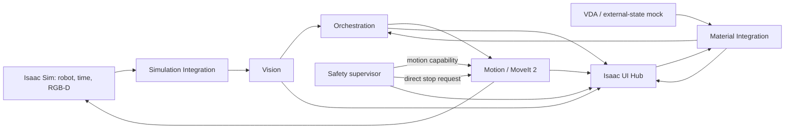

# SF-Twin ARM Cell

A simulator-backed ROS 2 workcell for developing and evaluating a Doosan M0609 robot with a Robotiq 2F-85 gripper. The project brings perception, motion planning, task orchestration, software safety supervision, material handoff, and an operator UI together around shared ROS interfaces.

The v0.2.0 public source demonstrates how to build a pick-and-place cell whose robot state, simulation time, transforms, camera observations, motion permission, and mission progress have explicit owners. It is an engineering and simulation project; it is not a validated production or safety-rated robot cell.

## Project Overview

The ARM Cell uses Isaac Sim as its simulated robot and sensor environment and ROS 2 as the integration and runtime layer. MoveIt plans and executes robot motion. The software is organized so that Vision reports observations, Orchestration sequences mission work, Motion performs robot tasks, Safety controls software motion capability, and Integration owns material-transfer readiness.

The current profile includes a simulated material-delivery path and an Isaac Sim UI Hub for operator observation and requests. External AMR/VDA, PLC, and safety-hardware state are represented by a mock adapter. The project does not implement AMR navigation or safety-rated E-stop/STO hardware.

## Key Features

- Shared Doosan M0609 and Robotiq 2F-85 robot description for ROS planning and Isaac Sim construction.
- ROS integration for canonical joint state, simulation time, TF, and RGB-D camera input.
- MoveIt 2 robot-only planning and an explicitly bounded static planning-scene profile.
- Request-driven RGB-D target detection with detector profiles and source-frame diagnostics.
- PICK, PLACE, GO_HOME, and recovery motion tasks behind backend-neutral ROS interfaces.
- Mission sequencing with material-readiness and Safety-permission checks.
- Software Safety supervision with fail-closed startup, motion capability, and a direct stop path to Motion.
- Simulated material handoff and an Isaac Sim UI Hub that observes state and routes requests through the owning components.

## System Architecture

The runtime keeps perception, mission decisions, robot execution, and motion permission in separate ROS components. Isaac Sim supplies simulated time, robot state, and camera data; the integration layer adapts those inputs to the shared ROS contracts and provides simulator-specific gripper behavior.



| Component | Responsibility and interaction |
|---|---|
| **Vision** | Acquires fresh RGB-D observations on `DetectTarget` requests, applies the selected detector profile, and returns a target observation with source-frame diagnostics. It does not grant motion permission. |
| **Motion** | Uses MoveIt 2 to plan and execute PICK, PLACE, GO_HOME, and related tasks. It applies robot/tool geometry and consumes Safety's motion capability. |
| **Orchestration** | Owns the mission cycle: requests targets from Vision, submits tasks to Motion, tracks outcomes, and coordinates retry or authorized recovery. It admits a material batch only when current readiness and Safety conditions allow it. |
| **Safety** | Evaluates required input freshness and operational conditions, publishes the sole software motion capability, and sends stop requests directly to Motion. It does not replace safety-rated hardware. |
| **Material Integration** | Connects operator supply requests to the external-state mock and publishes `MATERIAL_READY` only after the simulated handoff completes. Orchestration, not Integration, admits the mission. |
| **UI Hub** | Runs as an Isaac Sim/Kit extension. It presents camera and component state and sends requests to their owning components; it does not author canonical runtime state. |

## Technology Stack

- **ROS 2 Humble** — component communication, shared messages/actions/services, and workspace build.
- **Isaac Sim 5.1** — simulated M0609/2F-85 cell, robot state, simulation time, and RGB-D source.
- **MoveIt 2** — robot kinematics, planning-scene integration, motion planning, and execution.
- **C++ / `rclcpp`** — ROS runtime components, including Vision, Motion, Orchestration, Safety, and Integration.
- **Python** — Isaac Sim scene/runtime entrypoints, validation tooling, and the UI Hub extension.
- **Xacro, TF2, OpenCV, and OMPL** — robot description, transforms, image processing, and planning support.

## Getting Started

Clone the public repository:

```bash
git clone https://github.com/dev-kibeom/sftwin-arm-cell.git
cd sftwin-arm-cell
```

### Build the ROS workspace on a Humble host

With ROS 2 Humble and the package dependencies installed, build the supported workspace subset:

```bash
source /opt/ros/humble/setup.bash
cd ros2_ws
colcon build --packages-up-to arm_cell_bringup --cmake-args -DBUILD_TESTING=ON
source install/setup.bash
```

### Build with Docker

The root Dockerfile builds the same ROS subset in a Humble container. It verifies image construction and compilation; it does not provide Isaac Sim or run ROS nodes.

Run the following from the repository root:

```bash
docker build --progress=plain -t sftwin-arm-cell:humble .
```

See the [Docker build guide](docs/guides/docker-humble-build.md) for prerequisites and build output details.

### Run with Isaac Sim

Live operation requires ROS 2 Humble and Isaac Sim 5.1 on the host. The ROS build alone does not start the simulator or establish a live runtime. Follow the [ARM Cell Isaac Sim guide](docs/guides/arm-cell-isaac-sim.md) for prerequisites, the supported launch profiles, and the Isaac Script Editor entrypoints (`1_before_play.py` → Play → `2_after_play.py`).

## Documentation

- [Demo definition](docs/product/demos/arm-cell/definition.md)
- [System architecture](docs/architecture/) and [ARM Cell component designs](docs/components/arm-cell/)
- [ROS and simulator interface contracts](docs/interfaces/arm-cell/)
- [Architecture Decision Records (ADRs)](docs/adr/)
- [Engineering Stories](docs/engineering-stories/arm-cell/)
- [Technical records](docs/records/arm-cell/)
- [Acceptance reports](docs/reports/acceptance/)
- [Operator guides](docs/guides/)

## Current Status & Limitations

The public source contains the Vision, Motion, Orchestration, Safety, Material Integration, VDA mock, and UI Hub implementations described above. Their presence in source does not mean the complete final demonstration has passed live acceptance.

- **Build:** Public PR #2 recorded a successful Docker image build and a ROS 2 Humble `colcon build` of 11 packages through `arm_cell_bringup`. The public v0.2.0 export also recorded a successful ROS build. These results verify compilation, not a running Isaac Sim session.
- **Planning evidence:** Historical Milestone 1A robot-only planning and Milestone 1B bounded static-scene acceptance are documented in the [acceptance reports](docs/reports/acceptance/). The reports preserve their evidence limits: exact historical commit/tag identifiers are unavailable, and Milestone 1B does not establish general reachability or full-cell collision coverage.
- **Live runtime:** The v0.2.0 public export did not verify real-time Isaac Sim execution. Use the Isaac guide to run the supported profile in a configured environment; a build or historical planning result is not full mission acceptance.
- **RGB-D known issue:** Vision can intermittently fail to acquire a usable RGB-D pair before detector processing starts. The cause is still under investigation. See the [open acquisition issue record](docs/records/arm-cell/vision-rgbd-intermittent-acquisition-failure.md).
- **Simulation and safety boundary:** The VDA/external-state adapter is a mock subset; it is not full VDA 5050 or AMR navigation. Software Safety is not safety-rated E-stop/STO hardware and is not a substitute for it. Isaac Sim is the supported development environment; physical robot operation is not validated here.

## License & Third-Party Attribution

Project-owned code is available under the [MIT License](LICENSE). Robot models and other third-party assets retain their upstream terms. See [Third-Party Notices](THIRD_PARTY_NOTICES.md) and the retained upstream license/provenance files before redistributing those materials.
