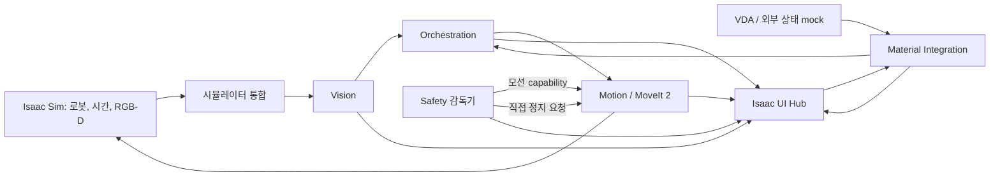

# SF-Twin ARM Cell

[한국어](README.md) | [English](README.en.md)

Doosan M0609 로봇과 Robotiq 2F-85 그리퍼를 대상으로 하는 시뮬레이터 기반 ROS 2 로봇 셀 프로젝트입니다. 비전, 모션 계획, 작업 오케스트레이션, 소프트웨어 안전 감독, 자재 인계, 운영자 UI를 공통 ROS 인터페이스로 연결합니다.

v0.2.0 공개 소스는 로봇 상태, 시뮬레이션 시간, 좌표 변환, 카메라 관측, 모션 허가, 미션 진행 상태의 소유 주체를 명확히 나누어 Pick & Place 셀을 구성하는 구현을 담고 있습니다. 엔지니어링 및 시뮬레이션 프로젝트이며, 생산용 셀이나 안전 등급을 인증받은 시스템은 아닙니다.

## 프로젝트 개요

Isaac Sim은 로봇과 센서가 동작하는 시뮬레이션 환경을 제공하고 ROS 2는 컴포넌트 통신과 런타임 통합을 담당합니다. MoveIt 2가 로봇 모션을 계획하고 실행합니다. Vision은 관측 결과를 제공하고, Orchestration은 미션 순서를 관리하며, Motion은 로봇 작업을 수행합니다. Safety는 소프트웨어 모션 권한을 판단하고 Integration은 자재 인계 완료와 준비 상태를 관리합니다.

현재 프로파일에는 시뮬레이션 자재 공급 경로와 Isaac Sim UI Hub가 포함되어 있습니다. 외부 AMR/VDA, PLC, 안전 하드웨어 상태는 mock 어댑터로 표현합니다. AMR 내비게이션과 안전 등급 E-stop/STO 하드웨어는 구현하지 않습니다.

## 주요 기능

- ROS 계획 및 Isaac Sim 셀 구성에 함께 사용하는 Doosan M0609·Robotiq 2F-85 로봇 설명 모델
- canonical joint state, 시뮬레이션 시간, TF, RGB-D 카메라 입력을 연결하는 ROS 통합
- MoveIt 2 기반 로봇 단독 계획과 범위를 명시한 정적 planning scene 프로파일
- detector profile과 source-frame 진단 정보를 사용하는 요청 기반 RGB-D 타깃 감지
- backend-neutral ROS 인터페이스를 통한 PICK, PLACE, GO_HOME 및 복구 모션 작업
- 자재 준비 상태와 Safety 모션 허가를 확인하는 미션 순서 관리
- fail-closed 시작, 모션 capability, Motion에 직접 전달하는 정지 요청을 지원하는 소프트웨어 Safety 감독
- 시뮬레이션 자재 인계와 각 컴포넌트의 상태를 관찰하고 요청을 전달하는 Isaac Sim UI Hub

## 시스템 아키텍처

런타임은 인지, 미션 의사결정, 로봇 실행, 모션 허가를 별도 ROS 컴포넌트로 나눕니다. Isaac Sim은 시뮬레이션 시간, 로봇 상태, 카메라 데이터를 제공합니다. Integration 계층은 이를 공통 ROS 계약에 맞게 연결하고 simulator 전용 그리퍼 동작을 처리합니다.



| 컴포넌트 | 책임과 상호작용 |
|---|---|
| **Vision** | `DetectTarget` 요청이 오면 최신 RGB-D 관측을 획득하고, 선택한 detector profile로 타깃을 찾아 source-frame 진단 정보와 함께 반환합니다. 모션 허가를 내리지는 않습니다. |
| **Motion** | MoveIt 2로 PICK, PLACE, GO_HOME 및 관련 작업을 계획·실행합니다. 로봇·도구 기하 보정을 적용하고 Safety의 모션 capability를 준수합니다. |
| **Orchestration** | Vision에 타깃을 요청하고 Motion에 작업을 제출하며 결과를 추적합니다. 재시도와 허가된 복구를 조정하고, 현재 자재 준비 상태와 Safety 조건이 충족될 때 미션을 시작합니다. |
| **Safety** | 필수 입력의 최신성과 운영 조건을 평가해 소프트웨어 모션 capability를 단독으로 발행하고 Motion에 직접 정지 요청을 보냅니다. 안전 등급 하드웨어를 대체하지 않습니다. |
| **Material Integration** | 운영자 자재 공급 요청을 외부 상태 mock에 전달하고 시뮬레이션 인계가 완료된 뒤에만 `MATERIAL_READY`를 발행합니다. 미션 시작 여부는 Orchestration이 결정합니다. |
| **UI Hub** | Isaac Sim/Kit 확장으로 동작합니다. 카메라와 컴포넌트 상태를 보여 주고 소유 컴포넌트에 요청을 보냅니다. canonical 런타임 상태를 직접 변경하지 않습니다. |

### 설계 의도

- **상태 소유권:** 각 컴포넌트는 자기 도메인의 상태와 결정을 소유합니다. 예를 들어 Material Integration은 인계 완료와 `MATERIAL_READY`를 발행하고, Orchestration은 이를 받아 미션 시작을 판단합니다. Safety는 모션 capability와 정지 판단을 소유하며, UI Hub는 이를 표시하고 요청만 전달합니다.
- **인터페이스 분리:** 컴포넌트 간 데이터와 동작은 공통 ROS 메시지·서비스·액션 계약으로 교환합니다. Motion은 backend-neutral 그리퍼 경계를 사용하고, simulator 세부사항이 미션 의미를 정의하지 않도록 합니다. 계약 문서는 인터페이스 문서에서 확인할 수 있습니다.
- **시뮬레이터 의존성 격리:** Isaac에서 얻은 상태와 그리퍼 동작은 Integration/backend 경계에서 ROS 계약으로 변환합니다. 이를 통해 상위 컴포넌트의 역할을 시뮬레이터 내부 표현과 구분합니다. 이 구조는 하드웨어 어댑터가 이미 제공되거나 실물 운전이 검증됐다는 뜻은 아닙니다.

### 대표 시나리오

운영자가 UI Hub에서 자재 공급을 요청하면 외부 상태 mock이 도착·도킹·하역을 시각화합니다. 하역과 인계가 완료된 뒤 Integration이 `MATERIAL_READY`를 발행하고, Orchestration은 Safety 허가와 현재 준비 상태를 확인해 미션을 시작합니다. 미션은 Vision에 RGB-D 타깃 감지를 요청하고, 결과를 바탕으로 Motion이 MoveIt 계획을 실행합니다. 이후 Orchestration은 PICK·holding 확인·PLACE·release 확인을 진행하며, Safety는 전체 과정에서 독립적으로 모션 capability와 정지 경로를 유지합니다.

이 흐름은 현재 공개 구현의 역할과 연결을 요약합니다. 전체 시나리오가 실시간 Isaac Sim 환경에서 최종 acceptance를 통과했다는 의미는 아닙니다.

## 기술 스택

- **ROS 2 Humble** — 컴포넌트 통신, 공통 메시지·액션·서비스, workspace 빌드
- **Isaac Sim 5.1** — M0609/2F-85 시뮬레이션 셀, 로봇 상태, 시뮬레이션 시간, RGB-D 입력
- **MoveIt 2** — 로봇 기구학, planning scene 연동, 모션 계획과 실행
- **C++ / `rclcpp`** — Vision, Motion, Orchestration, Safety, Integration 등 ROS 런타임 컴포넌트
- **Python** — Isaac Sim 장면·런타임 entrypoint, 검증 도구, UI Hub 확장
- **Xacro, TF2, OpenCV, OMPL** — 로봇 설명, 좌표 변환, 영상 처리, 모션 계획 지원

## 시작하기

공개 저장소를 clone합니다.

```bash
git clone https://github.com/dev-kibeom/sftwin-arm-cell.git
cd sftwin-arm-cell
```

### ROS 2 Humble 호스트에서 빌드

ROS 2 Humble과 패키지 의존성을 설치한 환경에서 지원 workspace를 빌드합니다.

```bash
source /opt/ros/humble/setup.bash
cd ros2_ws
colcon build --packages-up-to arm_cell_bringup --cmake-args -DBUILD_TESTING=ON
source install/setup.bash
```

### Docker로 빌드

루트 Dockerfile은 Humble 컨테이너 안에서 같은 ROS 범위를 빌드합니다. 이미지 생성과 컴파일을 확인하는 용도이며 Isaac Sim을 제공하거나 ROS 노드를 실행하지 않습니다.

저장소 루트에서 실행합니다.

```bash
docker build --progress=plain -t sftwin-arm-cell:humble .
```

사전 조건과 빌드 결과 확인 방법은 [Docker 빌드 가이드](docs/guides/docker-humble-build.md)를 참고하세요.

### Isaac Sim에서 실행

실시간 실행에는 호스트에 ROS 2 Humble과 Isaac Sim 5.1이 필요합니다. ROS 빌드만으로 simulator가 시작되거나 라이브 런타임이 검증되지는 않습니다. 사전 조건, 지원 launch profile, Isaac Script Editor entrypoint(`1_before_play.py` → Play → `2_after_play.py`)는 [ARM Cell Isaac Sim 가이드](docs/guides/arm-cell-isaac-sim.md)를 참고하세요.

## 문서 탐색

- [제품 및 ARM Cell 개요](docs/product/arm-cell-overview.md), [데모 정의](docs/product/demos/arm-cell/definition.md)
- [시스템 아키텍처](docs/architecture/), [ARM Cell 컴포넌트 설계](docs/components/arm-cell/)
- [ROS 및 simulator 인터페이스 계약](docs/interfaces/arm-cell/)
- [아키텍처 결정 기록(ADR)](docs/adr/)
- [Engineering Stories](docs/engineering-stories/arm-cell/)
- [기술 기록](docs/records/arm-cell/)
- [Acceptance 보고서](docs/reports/acceptance/)
- [운영 가이드](docs/guides/)

## 구현 상태 및 한계

공개 소스에는 위에서 설명한 Vision, Motion, Orchestration, Safety, Material Integration, VDA mock, UI Hub 구현이 포함되어 있습니다. 구현 코드가 존재한다는 사실만으로 최종 통합 데모의 라이브 acceptance까지 완료된 것은 아닙니다.

- **빌드:** 공개 PR #2에서 Docker 이미지와 `arm_cell_bringup`까지의 ROS 2 Humble `colcon build`가 성공했으며, 11개 패키지가 빌드됐습니다. v0.2.0 공개 export에서도 ROS 빌드 성공이 기록되어 있습니다. 이는 컴파일 결과이며 Isaac Sim 라이브 실행 검증은 아닙니다.
- **계획 검증 근거:** 과거 Milestone 1A 로봇 단독 계획과 Milestone 1B 제한 정적 planning scene acceptance는 [Acceptance 보고서](docs/reports/acceptance/)에 기록돼 있습니다. 과거 commit/tag 식별자가 없어 근거 추적에는 한계가 있고, Milestone 1B는 일반적인 도달 가능성이나 셀 전체의 충돌 검증을 보장하지 않습니다.
- **라이브 런타임:** v0.2.0 공개 export 과정에서는 Isaac Sim 실시간 실행을 검증하지 않았습니다. 별도의 과거 보고서에는 로봇 단독 계획 및 제한 정적 scene의 Isaac 검증 기록이 있지만, 전체 미션 acceptance를 의미하지 않으며 기준 revision 추적에도 한계가 있습니다. 구성된 환경에서의 실행 절차는 Isaac 가이드를 참고하세요.
- **RGB-D 알려진 문제:** Vision이 detector 처리에 들어가기 전에 사용 가능한 RGB-D 쌍을 간헐적으로 획득하지 못할 수 있습니다. 원인은 아직 조사 중입니다. 자세한 내용은 [RGB-D acquisition 이슈 기록](docs/records/arm-cell/vision-rgbd-intermittent-acquisition-failure.md)을 참고하세요.
- **시뮬레이션·안전 경계:** VDA/외부 상태 어댑터는 mock subset이며 전체 VDA 5050이나 AMR 내비게이션 구현이 아닙니다. 소프트웨어 Safety는 안전 등급 E-stop/STO 하드웨어가 아니며 이를 대체하지 않습니다. Isaac Sim이 지원 개발 환경이고 실물 로봇 운전은 검증 범위에 포함되지 않습니다.

## 라이선스 및 제3자 저작물

프로젝트 자체 코드는 [MIT License](LICENSE)를 따릅니다. 로봇 모델과 제3자 에셋에는 각각의 upstream 조건이 적용됩니다. 재배포 전 [Third-Party Notices](THIRD_PARTY_NOTICES.md)와 함께 배포된 upstream 라이선스 및 출처 정보를 확인하세요.
