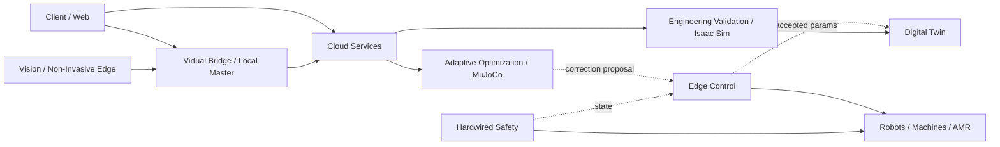

# [SF-Twin] System Component Architecture

- **Document ID:** `[SF-Twin]_ARCH-COMPONENTS_v1.1.0`
- **Document Type:** Architecture
- **Architecture Scope:** SYSTEM
- **Version:** 1.1.0
- **Status:** Draft
- **Owner:** Architecture Authority
- **Source:** `[SF-Twin]_SAD_v13.0` decomposition
- **Related Capabilities:** `WEB`, `BF-LITE`, `BF-STD`, `GF-D1`, `GF-D2`

## 1. Purpose

시스템의 주요 logical capability와 subsystem responsibility를 black-box HLD 수준에서 정의한다.

이 문서는 backend domain 내부 ports/adapters, ROS 2 node 내부 구현, class/module detail을 소유하지 않는다.

## 2. Architectural Principles

### 2.1 Time Criticality

- deterministic / low-latency / hardware-near control은 Edge에 위치한다.
- macro application logic, asynchronous orchestration, heavy analysis/optimization은 Cloud에 위치한다.

### 2.2 Dependency Direction

Domain responsibility는 framework, middleware, DB, simulator 같은 infrastructure detail과 분리한다.

### 2.3 Time-Scale Separation

- Edge: sensing, local state, validation, bounded control application
- Cloud: SaaS, engineering orchestration, asynchronous optimization
- Hardware Safety: software/network와 독립된 physical safety authority

### 2.4 Lifecycle Separation

- Isaac Sim: `GF-D1` engineering validation / high-fidelity digital replica
- MuJoCo: `GF-D2` asynchronous Batch SysID / adaptive optimization

두 simulator responsibility를 단일 runtime authority로 합치지 않는다.

## 3. Major System Components / Capabilities

| Component / Capability | System-Level Responsibility | Primary Product Trace |
|---|---|---|
| Client / Operator UI | layout and interference visualization, monitoring, operator interaction | — |
| Digital Twin | asset identity, physical baseline, calibration coordination, accepted-parameter resynchronization | `GPC-02`, `FR-GF-D2-04` |
| Production Context / Scheduling | production state, scheduling, OEE/FPY metrics | `BF-STD` |
| Virtual Bridge / Local Master | read-only machine + operator-context mapping, canonical PackML operational state | `BF-STD` |
| Vision / Non-Invasive Edge | sensing, counting, local privacy/quality processing, advisory events | `BF-LITE` |
| Engineering Validation | LiDAR/OpenUSD reconstruction, Isaac Sim Track 1/2 validation, engineering evidence | `GF-D1` |
| Adaptive Optimization | Cloud MuJoCo Batch SysID, correction proposal generation | `GF-D2` |
| Edge Control | local control state, Local Sanity Guard, bounded correction acceptance, fallback | `GF-D1`, `GF-D2` |
| Predictive Maintenance / Observer | DSP/FFT monitoring and maintenance signal generation | `GF-D2` |
| Deploy / Artifact Management | package/model/parameter release and deployment orchestration | `BF-LITE`, `GF-D1`, `GF-D2` |
| Hardwired Safety | legal E-Stop physical actuation authority | `GPC-01`, `GF-D1` |

## 4. System Dependency Direction

세부 dependency map은 subsystem CDS/ICD 또는 local architecture에서 소유한다.

## 5. Cross-Component Responsibilities

### 5.1 Operational State

PackML operational state authority는 Virtual Bridge / Edge Local Master에 있다.
Cloud MES/APS는 Read Replica를 소비한다.

### 5.2 Count Arbitration

`FR-BF-STD-02`에 따라 Vision count와 CNC M-code count가 충돌하면:

- CNC count가 canonical Master count다.
- Vision count는 validation/diagnostic evidence로 유지한다.

이 authority는 HLD data boundary이며 exact payload/schema는 ICD가 소유한다.

### 5.3 Day-1 Engineering Validation

Engineering Validation capability는:

- LiDAR/OpenUSD full-scale environment
- Macro Line logistics/recovery validation
- Micro Cell vision/contact/grasp validation

을 소유한다.

이 capability는 field runtime control authority가 아니다.

### 5.4 Day-2 Adaptive Optimization

Adaptive Optimization capability는 field log를 바탕으로 correction/physical parameter 후보를 계산할 수 있다.

- Cloud가 후보를 계산한다.
- Edge Local Sanity Guard가 acceptance를 결정한다.
- accepted parameter만 runtime/twin lifecycle에 반영한다.

### 5.5 Hardware Safety

Hardwired Safety는 software component tree와 별도 authority domain이다.

Vision safety monitoring은 advisory-only이며 Hardwired Safety를 대체하지 않는다.

## 6. Child Component Boundary Rule

Child component는 본 문서에서 black box로 취급한다.

다음은 lower-level design으로 이동한다.

- inbound/outbound port 목록
- adapter technology
- DTO / payload field
- internal domain model
- internal retry/state sequence
- framework-specific exception translation
- repository/persistence implementation
- exact ROS 2 topic/service/action
- exact simulator API binding

## 7. Open Decisions

- `mes_aps`, `deploy` 등 legacy SAD domain 명칭과 current repository structure의 차이는 backend CDS/code gap analysis에서 검토한다.
- Engineering Validation / Adaptive Optimization의 실제 code/package placement는 HLD responsibility를 보존하는 범위에서 downstream design이 결정한다.
