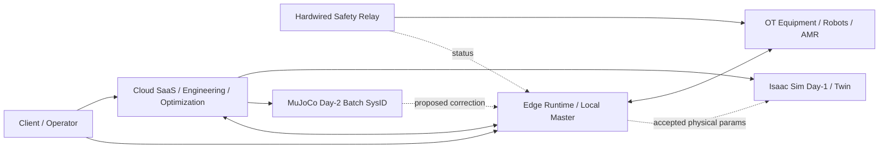

# [SF-Twin] System Overview Architecture

- **Document ID:** `[SF-Twin]_ARCH-SYSTEM-OVERVIEW_v1.1.0`
- **Document Type:** Architecture
- **Architecture Scope:** SYSTEM
- **Version:** 1.1.0
- **Status:** Draft
- **Owner:** Architecture Authority
- **Source:** `[SF-Twin]_SAD_v13.0` decomposition
- **Related Capabilities:** `WEB`, `BF-LITE`, `BF-STD`, `GF-D1`, `GF-D2`

## 1. Purpose

SF-Twin의 system-level purpose, major layers, product/engineering lifecycle,
global authority boundaries, quality attributes, major E2E flow를 HLD 수준에서 정의한다.

이 문서는 child component의 내부 구현을 소유하지 않는다.

## 2. Scope

### 2.1 In Scope

- Cloud / Edge / OT Hardware / Client의 system boundary
- Brownfield → Greenfield lifecycle
- Tier 3 Day-1 engineering validation과 Day-2 autonomous operation의 상위 책임
- Real-to-Sim / Sim-to-Real responsibility
- global product constraints의 architecture projection
- system-level quality attributes와 E2E flow

### 2.2 Out of Scope

- backend domain 내부 ports/adapters
- ROS 2 topic/message/TF 상세
- component 내부 state transition / retry choreography
- DB entity/DDL
- code-level implementation
- requirement priority 자체

## 3. System Vision

SF-Twin은 Web 3D concept design을 진입점으로 하여 Brownfield non-invasive monitoring에서
Greenfield unmanned line/cell engineering 및 autonomous operation으로 확장되는
smart manufacturing digital-twin platform이다.

시스템은 다음 표준 및 생태계와 연계될 수 있도록 설계한다.

- ISA-95 / ISA-88
- B2MML
- IDTA AAS Metamodel V3.0
- OPC UA
- VDA 5050
- Open-RMF
- ROS 2

### 3.1 Global Product Constraints

- `GPC-01` — Process Pause / Vision advisory와 legal E-Stop authority를 분리한다.
- `GPC-02` — Brownfield → Greenfield 전환에서 asset identity와 canonical metadata continuity를 유지한다.

## 4. Major Architectural Domains

### 4.1 Client Layer

Client는 Web browser, operator tablet, monitoring tool을 포함한다.

- human interaction과 visualization을 제공한다.
- Process Pause 등 허용된 operational command를 요청할 수 있다.
- legal E-Stop authority 또는 canonical process-state authority를 소유하지 않는다.

### 4.2 Cloud Layer

Cloud Layer는 macro-scale SaaS / engineering / optimization responsibility를 담당한다.

- Web 3D concept design, loss/ROI/ROM
- Digital Twin asset management
- MES/APS, OEE/FPY, KPI/B2B
- deployment/artifact lifecycle
- Day-1 engineering assets와 validation orchestration
- Day-2 asynchronous MuJoCo Batch SysID
- accepted physical parameter의 twin resynchronization

Cloud는 deterministic field control loop의 direct runtime authority가 아니다.

### 4.3 Edge Layer

Edge Layer는 hardware-near / time-sensitive responsibility를 담당한다.

- non-invasive sensing과 legacy read-only integration
- PackML Local Master
- local control state
- Process Pause execution path
- Local Sanity Guard
- bounded in-cycle correction
- Graceful Fallback / Ramp-down Safe Mode
- disconnected autonomy와 Store-and-Forward
- hardwired safety state observation

### 4.4 OT / Hardware Safety Layer

Legal Emergency Stop은 Hardwired Dual-Channel safety relay가 physical authority를 가진다.

Software는 E-Stop actuation authority를 대체하지 않으며,
auxiliary/observation path를 통해 상태를 관찰·전파한다.

## 5. Product / Engineering Lifecycle

### 5.1 WEB — Concept Design

관련 요구: `FR-WEB-01`, `FR-WEB-02`

- browser-based layout / interference preview
- downtime reduction / ROI preview
- dynamic routing preview
- preliminary ROM과 consultation handoff

### 5.2 BF-LITE — Tier 1 Brownfield

관련 요구: `FR-BF-LITE-01` ~ `FR-BF-LITE-05`

- non-invasive sensor self-onboarding
- production counting / lens contamination detection
- self vision labeling
- advisory-only safety vision
- supervisor UI / Process Pause
- edge vision weight hot-swap

### 5.3 BF-STD — Tier 2 Brownfield

관련 요구: `FR-BF-STD-01` ~ `FR-BF-STD-03`

- external Ethernet Read-Only / signal wrapping
- Virtual OPC UA / PackML mapping
- CNC Master count arbitration
- official OEE/FPY, Light APS
- Tier 3 investment analysis

### 5.4 GF-D1 — Tier 3 Day-1 Engineering

관련 요구: `FR-GF-D1-01` ~ `FR-GF-D1-05`

```text
Remote Screening
→ LiDAR Survey
→ OpenUSD Full-Scale Replica
→ Isaac Sim Track 1: Macro Line
→ Isaac Sim Track 2: Micro Cell
→ Field IPC / Hardwired Safety Deployment
→ FAT / SAT
```

#### Track 1 — Macro Line

- PackML state와 buffer condition
- AMR/VDA 5050 logistics
- robot kinematic mock
- reroute/recovery
- line MTTR
- system-level logistics validation

#### Track 2 — Micro Cell

- synthetic 3D vision
- contact/friction/slip
- grasp/regrasp
- cell-level physical behavior
- workcell fault/recovery validation

Isaac Sim은 Day-1 engineering/high-fidelity validation environment로 사용한다.

### 5.5 GF-D2 — Tier 3 Day-2 Autonomous Operation

관련 요구: `FR-GF-D2-01` ~ `FR-GF-D2-04`

```text
Edge DSP / PdM
+ bounded In-Cycle Correction
        ↓
idle interval
        ↓
Cloud MuJoCo Batch SysID
        ↓
Local Sanity Guard
        ↓
Accepted Parameter Hot-Swap
        ↓
Isaac Sim Twin Auto-Resync
```

MuJoCo는 Day-2 asynchronous headless optimization / SysID를 담당하며
field real-time control authority를 소유하지 않는다.

## 6. System Quality Attributes

| Attribute | System-Level Architecture Constraint | Product Trace |
|---|---|---|
| Safety Authority | legal E-Stop은 hardwired authority | `GPC-01`, `NFR-GF-D1-05`, `NFR-GF-D1-07` |
| Process Pause | local operational path, ≤ 500 ms target | `NFR-BF-LITE-06` |
| Brownfield Intrusion | non-invasive / read-only | `NFR-BF-LITE-01`, `NFR-BF-STD-01` |
| Greenfield Network | TSN wired + ROS 2 DDS control class | `NFR-GF-D1-01` |
| Control Determinism | Edge control timing은 Cloud workload와 격리 | `NFR-GF-D1-06`, `NFR-GF-D2-09` |
| Adaptive Correction | Cloud correction은 Local Sanity Guard를 우회하지 못함 | `NFR-GF-D2-02`, `NFR-GF-D2-05` |
| Day-2 Optimization | Batch SysID ≤ 3 min target | `NFR-GF-D2-03` |
| Edge Autonomy | WAN 단절 시 최소 72시간 local autonomy | `NFR-GF-D2-06`, `NFR-GF-D2-07` |
| Twin Alignment | accepted parameter를 twin에 Auto-Resync | `NFR-GF-D2-08` |
| Asset Continuity | lifecycle 간 AAS-compatible identity 유지 | `GPC-02`, `NFR-BF-STD-03` |

구체 검증 방법은 downstream design의 Verification Requirements와 plan이 소유한다.

## 7. System-Level Flow



## 8. Architectural Invariants

- `GPC-01`에 따라 Process Pause / Vision advisory와 legal E-Stop authority를 혼동해서는 안 된다.
- `GPC-02`에 따라 Brownfield → Greenfield 전환에서 asset identity continuity를 유지해야 한다.
- PackML canonical state authority는 Edge Local Master에 있어야 한다.
- Cloud state는 operational Read Replica로 동작해야 한다.
- Cloud는 field deterministic control loop를 직접 소유해서는 안 된다.
- Day-1 Isaac validation과 Day-2 MuJoCo optimization은 서로 다른 lifecycle responsibility로 유지해야 한다.
- Cloud-originated correction은 Local Sanity Guard를 통과하지 않고 runtime control에 적용되어서는 안 된다.
- Sanity Guard rejection은 invalid correction 폐기 후 Ramp-down Safe Mode로 이어져야 한다.

## 9. Related Architecture

- `deployment.md`
- `components.md`
- `state-and-data.md`
- `communication.md`
- `safety-and-control.md`

## 10. Open Decisions

현재 Product family와의 정합성 관점에서 추가 system-level product decision은 없다.
Repository/code와의 구현 gap은 downstream CDS/code audit에서 검토한다.
